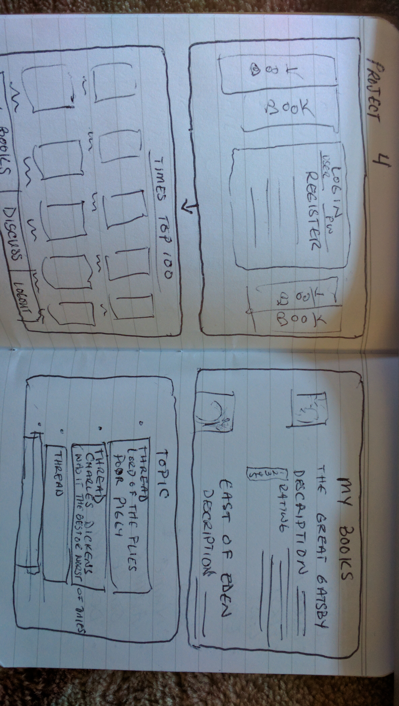
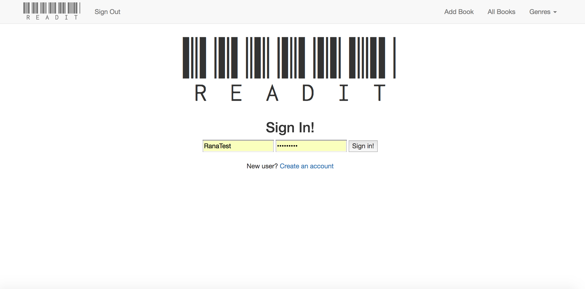
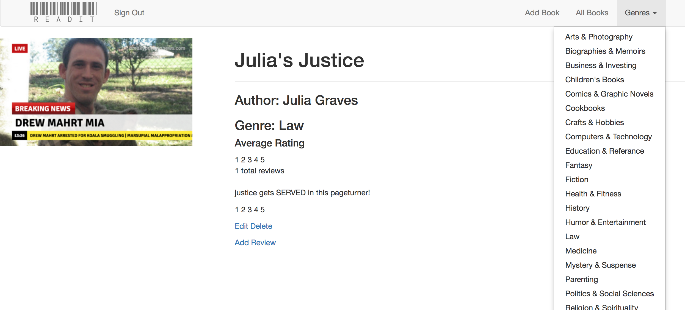

# README

## Personal Library App

Wire Frames 

Live

(didnt end up using but may add in the future)API https://www.programmableweb.com/api/new-york-times-best-sellers

## User Stories

I have an addiction as I am sure many people do. I like to read but the problem these days is that I find myself buying boks and never having the time to read them. The goal of this app is to keep track of books that the user would like to read, give them a view of the top 100 books and give them the ability to add to their reading list. They would be able to add new books, mark them as read, or 
something they intend to read.

## Technologies Used

html/ejs, ruby on rails, mvc, css, javascript/jquery

## Database Structure

Need atleast two tables - One for users with (userid, username, first_name, last_name) Second for books  (book name, id, genre ,description )

## Basic Functionality

Basic functionality should be the ability to register log in and basic CRUD functionality for adding books with their descriptions ratings and comments which
will have crud functionality again.

## Addition

Once that step is reached I would like to view the top 100 books, have to search for a times or amazon api that lists the current popular books.

Culd not get this to work so will try to add it in a future iteration.

## Advanced Features

Beyond that I would like to add a forum where there can be discussions on the books to make it sort of a book club.polymorphic table for discussionboard - this is also a WIP and will be added in the future.

## Project Flow

Ended up having to start over a few times due to unreconsilable errors in the format before the final one worked out. Ended up following a guide from Ryan Hemrick whos youtube channel(https://www.youtube.com/watch?v=AMai9EZesXY) had pretty much exacty what I wanted to do with my app as far as the MVP goes. Ended up using it as a framework for my app which is still a WIP and I plan on adding more functionality as was listed in the addition and advanced features. What is shown in app is a restart working off of two days monday, and tuesday after multiple restarts. The auth is based on Ari Brenners lecture because I wanted to understand what was going on instead of just using the devise gem and and just ending up with a product which I didnt know the inner workings of. The Raty module worked great as far as local host but seems to have lost functionality on heroku. Paperclip gem to add the picture of the book does not keep its assets on heroku for more than 5 minutes. Im looking for solutions for both of these issues and should have something back up soon. All in all, my MVP was reached but I do plan on refactoring so that the functionality works better the css needs improving and just in general needed a few more days on it. Im okay with how it turned out but happier that I have learned in the process more than my final result at this time.